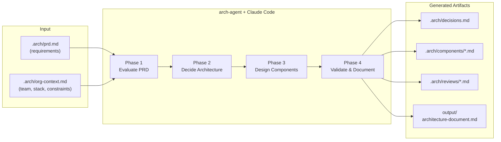
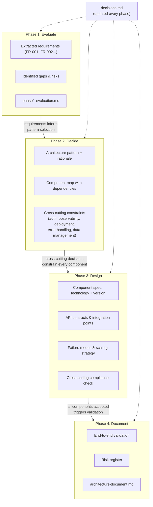
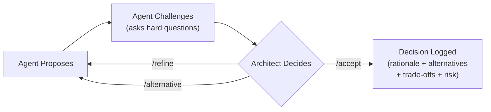

# arch-agent

[](https://www.npmjs.com/package/arch-agent)
[](LICENSE)
[]()

**Structured architecture design for AI-assisted development.**

arch-agent turns [Claude Code](https://docs.anthropic.com/en/docs/claude-code) into an opinionated architecture reviewer that guides your team through a rigorous, phase-gated design process. It challenges assumptions, enforces decision gates, and produces a documented architecture — not just a generated wall of text.

## The Problem

Architecture decisions are the most expensive to reverse. Yet most teams either:

- **Skip formal design** and pay for it later in rework
- **Generate AI docs** that say "yes" to everything and reflect no real constraints
- **Write documents once** that become outdated and disconnected from reality

arch-agent solves this by combining AI reasoning with human-controlled gates. The AI proposes and challenges. You decide. Every decision is logged with rationale, alternatives, and trade-offs.

## Where arch-agent Fits



**Input:** Your PRD and organizational context (team size, tech stack, constraints), placed in the `.arch/` directory.

**Output:** A decision log, detailed component specs, adversarial review findings, and a comprehensive architecture document — every choice backed by rationale and alternatives. Artifacts are produced throughout the phases, not only at the end.

## End-to-End Workflow

Here is the complete journey from requirements to architecture output:

**1. Scaffold the project**

```bash
npx arch-agent init --name "My Project"
```

This creates `.arch/` (state machine, validation scripts, working files), `.claude/` (slash commands, skills, hook configuration), and `CLAUDE.md` (agent identity and rules).

**2. Provide your requirements**

Write or paste your Product Requirements Document into `.arch/prd.md`. Optionally describe your team size, tech stack, and constraints in `.arch/org-context.md`. If you skip org-context, the agent interviews you during Phase 1 (15 questions across scale, team, and constraints).

**3. Start Claude Code and run the architecture process**

```bash
claude
```

Then type `/analyze-prd` to begin. The agent walks you through four phases:

| Phase | What Happens | Command | Artifact Produced |
|-------|-------------|---------|-------------------|
| **1. Evaluate** | Analyzes your PRD, extracts requirements, finds gaps, assesses risks | `/analyze-prd` | `.arch/phase1-evaluation.md` |
| **2A. Pattern** | Proposes architecture pattern with rationale and alternatives | `/propose-methodology` | `.arch/phase2-methodology.md` |
| **2B. Components** | Maps all system components, dependencies, and integration points | `/propose-methodology` | `.arch/phase2-components-overview.md` |
| **2C. Cross-Cutting** | Locks auth, observability, deployment, error handling, data management | `/propose-methodology` | `.arch/phase2-cross-cutting.md` |
| **3. Design** | Details each component: technology + version, API contracts, failure modes | `/design-component [name]` | `.arch/components/[name].md` |
| **4. Document** | Validates end-to-end consistency, builds risk register, generates final doc | `/generate-docs` | `output/architecture-document.md` |

**4. Review and accept at each gate**

At every phase boundary, the agent presents its proposal. You review it and:
- `/accept` — Confirm the proposal and advance to the next phase
- `/refine [feedback]` — Request specific changes while staying in the current phase
- `/alternative [request]` — Request a completely different approach

The agent cannot skip phases or auto-accept. This is enforced by Python validation hooks at the file system level, not by prompt instructions.

**5. Collect your architecture**

When complete, your project contains a full set of architecture artifacts: evaluated requirements, accepted decisions with rationale, detailed component designs, and a comprehensive architecture document in `output/architecture-document.md`.

## How Artifacts Evolve Across Phases

Architecture knowledge builds incrementally. Each phase produces artifacts that feed into the next:



Every decision is logged to `.arch/decisions.md` as it happens — not retroactively. By Phase 4, the decision log contains the complete rationale trail for every architectural choice.

## Example: Designing an E-Commerce Platform

A team of 6 engineers is building an e-commerce platform. Here's the full journey:

**Input:** The team writes a PRD describing product catalog, shopping cart, checkout, payments, and order management. They note their constraints in org-context: 6 engineers, existing PostgreSQL expertise, 12-month runway, no Kubernetes experience.

```bash
npx arch-agent init --name "ShopFlow"
# Team writes PRD in .arch/prd.md and org-context in .arch/org-context.md
claude
```

**Phase 1 — Evaluate:**
```
/analyze-prd
```
The agent extracts 14 functional requirements and flags 4 critical gaps: no mention of inventory consistency model, missing payment failure recovery strategy, undefined latency SLA, and no data retention policy. The team answers the agent's questions, refines the analysis, and accepts.

*Artifact produced: `.arch/phase1-evaluation.md`*

**Phase 2 — Decide:**
```
/propose-methodology
```
- **2A:** Agent proposes modular monolith — team of 6 with no Kubernetes experience shouldn't operate microservices. Compares against microservices (rejected: operational burden) and serverless (rejected: cold start on checkout). Team accepts.
- **2B:** Agent maps 6 components: API Gateway, Product Catalog, Shopping Cart, Checkout & Payments, Order Management, Notification Service. Shows dependency graph. Team accepts.
- **2C:** Agent locks cross-cutting: JWT auth with RS256, structured JSON logging via Pino, Docker Compose deployment (no K8s), exponential backoff retries, PostgreSQL per-module schemas with eventual consistency for cart-to-order transition. Team accepts.

*Artifacts produced: `.arch/phase2-methodology.md`, `.arch/phase2-components-overview.md`, `.arch/phase2-cross-cutting.md`*
*Decisions logged: DEC-001 through DEC-009 in `.arch/decisions.md`*

**Phase 3 — Design:**
```
/design-component product-catalog
```
The agent designs each component one at a time. For Product Catalog: PostgreSQL 16 with full-text search, REST API with pagination, Redis 7 cache for hot products, failure mode if Redis is down (fall through to DB). The agent checks compliance against Phase 2C cross-cutting decisions. Team accepts. Agent advances to Shopping Cart, then Checkout & Payments, and so on.

*Artifacts produced: `.arch/components/product-catalog.md`, `.arch/components/shopping-cart.md`, etc.*
*Decisions logged: DEC-010 through DEC-021*

**Phase 4 — Validate & Document:**
```
/generate-docs
```
The agent traces 3 critical user journeys (browse-to-purchase, payment failure recovery, order cancellation) through all components, verifying integration points. Builds a risk register scoring 8 identified risks by probability and impact. Generates the final architecture document.

*Artifact produced: `output/architecture-document.md`*

**Result:** A complete architecture with 21 logged decisions, 6 detailed component specs, and a comprehensive document — ready for implementation, onboarding, or audit.

## Generated Artifacts

arch-agent produces architecture artifacts throughout the process, not just at the end:

| Artifact | Location | When Produced | Contents |
|----------|----------|---------------|----------|
| **Decision log** | `.arch/decisions.md` | Every phase | Each decision with ID, rationale, alternatives, trade-offs, and risk |
| **PRD evaluation** | `.arch/phase1-evaluation.md` | Phase 1 | Extracted requirements, gaps rated by severity, risk assessment |
| **Architecture pattern** | `.arch/phase2-methodology.md` | Phase 2A | Chosen pattern, rationale, alternatives compared |
| **Component map** | `.arch/phase2-components-overview.md` | Phase 2B | All components, dependencies, integration points |
| **Cross-cutting decisions** | `.arch/phase2-cross-cutting.md` | Phase 2C | Auth, observability, deployment, error handling, data strategies |
| **Component designs** | `.arch/components/[name].md` | Phase 3 | Technology + version, API contracts, failure modes, scaling |
| **Review findings** | `.arch/reviews/[name].md` | Phase 3 (optional) | Adversarial review results from `/review-component` |
| **Architecture document** | `output/architecture-document.md` | Phase 4 | Comprehensive deliverable consolidating all decisions |

**Example decision log entry:**
```
### [DEC-003] Phase 2A | Architecture Pattern
- Decision: Modular monolith with event-driven boundaries
- Rationale: 6-person team, single deployment unit reduces operational burden
- Alternatives: Microservices (rejected: team too small), Serverless (rejected: cold start latency)
- Trade-offs: Sacrifices independent deployment for operational simplicity
- Risk: Module boundaries may need extraction to services at 10x scale
```

**Example component design (abbreviated):**
```
## Auth Service — Component Design

Technology: Keycloak 24.0 (self-hosted) + PostgreSQL 16
Pattern: OAuth 2.0 + OIDC, RS256 JWT tokens

Integration Points:
  IN:  POST /auth/token  <- API Gateway (client credentials)
  IN:  POST /auth/login  <- Web Client (authorization code flow)
  OUT: JWT validation    -> All services (public key endpoint)

Failure Modes:
  - Keycloak down -> Circuit breaker, return cached JWKS for 15min
  - Database failover -> Read replica promotion, ~30s token delay
  - Token leak -> Revocation endpoint + short-lived tokens (5min)

Cross-Cutting Compliance:
  Auth: RS256 JWT per Phase 2C decision DEC-007
  Observability: Structured JSON logs, login attempt metrics
  Deployment: Helm chart, horizontal pod autoscaler
```

## When to Use arch-agent

| Scenario | How arch-agent Helps |
|----------|---------------------|
| **Starting a new project from a PRD** | Evaluates your requirements, finds gaps, proposes an architecture, and designs every component — with rationale for each choice |
| **Structured architecture governance** | Enforces phase gates, decision logging, and explicit acceptance — every decision has a paper trail |
| **Documented architecture decisions** | Produces a complete decision log for compliance, onboarding, or audit — not tribal knowledge in someone's head |
| **Reviewing an existing architecture** | Import your document with `arch-agent import`, and the agent walks through each phase challenging what exists |
| **AI-assisted design with human control** | The AI proposes and challenges; you decide at every gate. No auto-acceptance, no skipped phases |
| **Onboarding engineers to a system** | The generated architecture document and decision log explain not just what was decided, but why — with alternatives considered and risks documented |

## Quick Start

### New project

```bash
npx arch-agent init --name "My Project"
```

Then:
1. Write your requirements in `.arch/prd.md`
2. Optionally describe your team and constraints in `.arch/org-context.md`
3. Start Claude Code and type `/analyze-prd`

### Existing architecture

```bash
npx arch-agent import existing-architecture.md --name "My Project"
```

The agent parses your document and walks through each phase, challenging your existing decisions. Accept what's solid, refine what's outdated. Imported projects get 5 reopens (vs 2) for more iteration room.

**Requirements:** Node.js 18+, [Claude Code](https://docs.anthropic.com/en/docs/claude-code), Python 3, git

## Commands

### Workflow commands

| Command | Description |
|---------|-------------|
| `/analyze-prd` | Evaluate PRD, find gaps, assess risks |
| `/propose-methodology` | Architecture pattern, component map, cross-cutting decisions |
| `/design-component [name]` | Detailed design for one component |
| `/generate-docs` | Validate and generate final architecture document |
| `/import-architecture` | Import and review an existing architecture document |

### Decision commands

| Command | Description |
|---------|-------------|
| `/accept` | Accept current proposal and advance |
| `/refine [feedback]` | Request specific changes |
| `/alternative [request]` | Request a different approach |
| `/reopen [target] [reason]` | Reopen an accepted decision (max 2 per project) |

### Utility commands

| Command | Description |
|---------|-------------|
| `/review-component [name]` | Launch adversarial review of a component |
| `/status` | Show current progress |
| `/decision-log` | Show all recorded decisions |
| `/help` | Show available commands for current phase |

## Decision Governance

Every architectural decision flows through a controlled lifecycle:



Decisions are **immutable once accepted** — unless you spend one of your limited reopens (max 2 per project). Reopening cascades: changing an early decision un-accepts everything downstream.

## Key Design Decisions

**Hard enforcement, not prompt instructions.** Python validation hooks block illegal state transitions at the file system level. Phase skipping, backward transitions, and component injection are blocked regardless of what the AI is asked to do.

**Cross-cutting decisions before component design.** Auth, observability, deployment, and error handling strategies are locked in Phase 2C. Every component in Phase 3 must comply with these constraints. This prevents inconsistency across components.

**One component at a time.** Phase 3 designs components sequentially in dependency order. Each component is reviewed against previously accepted components for integration consistency. No parallel design that leads to interface mismatches.

**Controlled iteration.** The `/reopen` command allows going back to fix decisions with cascading invalidation. Reopening Phase 2A un-accepts 2B, 2C, and marks all components as "needs-review". Limited to 2 reopens per project to prevent design thrashing.

## Project Structure

```
your-project/
├── CLAUDE.md                         # Agent identity and phase rules
├── .arch/
│   ├── state.json                    # Phase state machine
│   ├── prd.md                        # Your requirements (you edit this)
│   ├── org-context.md                # Team, stack, constraints (you edit this)
│   ├── decisions.md                  # Auto-generated decision log
│   ├── scripts/
│   │   ├── validate-transition.py    # Enforcement hook
│   │   └── log-decision.py           # Auto-logging hook
│   ├── components/                   # Component design outputs
│   └── reviews/                      # Adversarial review findings
├── .claude/
│   ├── settings.json                 # Hook configuration
│   ├── commands/                     # Slash commands
│   └── skills/                       # Auto-activating skills
└── output/
    └── architecture-document.md      # Final deliverable
```

## CLI Reference

```bash
npx arch-agent init [--name <name>] [--force]     # Scaffold a new project
npx arch-agent import <source> [--name <name>]     # Import existing architecture
npx arch-agent verify                               # Check prerequisites
npx arch-agent reset [--yes]                        # Reset state to initial
```

## Documentation

- [User Guide](docs/USER-GUIDE.md) — Step-by-step walkthrough
- [Architecture](docs/ARCHITECTURE.md) — System design and enforcement layers
- [Methodology](docs/METHODOLOGY.md) — Four-phase design methodology
- [Contributing](docs/CONTRIBUTING.md) — How to contribute
- [Changelog](CHANGELOG.md) — Version history

## License

MIT
